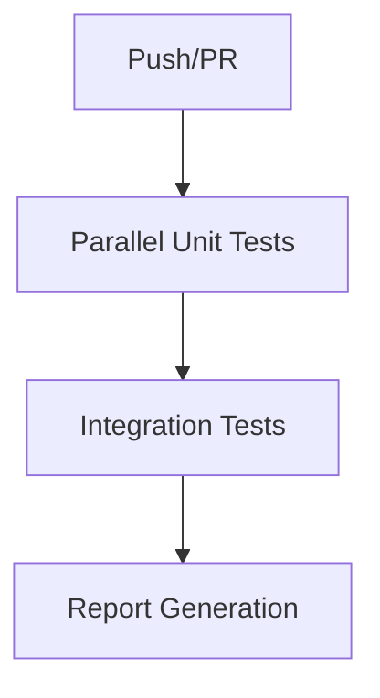

# Contributing to D-Loop Protocol

Thank you for your interest in contributing to the D-Loop Protocol! This document provides guidelines for contributing to the project.

## Code Style

- Follow the Solidity style guide
- Use 4 spaces for indentation
- Use NatSpec comments for all public functions and contracts
- Maximum line length is 100 characters

## Development Workflow

1. Fork the repository
2. Create a feature branch
3. Make your changes
4. Run tests and ensure they pass
5. Submit a pull request

## Testing

### Ethers.js Usage Guidelines

The D-Loop Protocol uses ethers.js v6 with a compatibility layer for ethers v5 APIs. To ensure consistent usage across the codebase:

1. **Always import ethers using the standardized alias**:
   ```javascript
   // Correct way to import ethers
   const ethers = require('@ethers-shim');
   ```

2. **Never import ethers directly or use relative paths**:
   ```javascript
   // Incorrect - do not use
   const ethers = require('ethers');
   const ethers = require('../../utils/ethers-v6-shim');
   ```

3. **Use the provided compatibility APIs for ethers v5 functionality**:
   ```javascript
   // Examples of compatibility APIs
   const amount = ethers.utils.parseEther('1.0');
   const address = ethers.constants.AddressZero;
   const bn = ethers.BigNumber.from('1000');
   ```

4. **Run linting to ensure compliance**:
   ```bash
   npm run lint
   # To automatically fix issues
   npm run lint:fix
   ```


- Write tests for all new functionality
- Ensure all tests pass before submitting a PR
- Run gas optimization tests for critical functions

## Testing Standards

### CI Pipeline Overview


### Key Changes:
- **Matrix Testing**: Core contracts tested in parallel
- **Gas Reports**: Archived as workflow artifacts
- **Coverage Enforcement**: 90%+ required

### New Commands:
```bash
# Run specific contract tests
npm test:unit -- AssetDAO

# Run integration tests only 
npm test:integration
```

## Mock Contract Development

- All mock contracts must be placed in `/test/mocks/`
- Mock contracts must be named with the `Mock` prefix (e.g., `MockAssetDAO.sol`)
- Mock contracts should inherit from `BaseMock.sol` to leverage standard mock functionality
- Use `_recordFunctionCall()` to track function calls for testing purposes
- Run `node scripts/validate-mocks.js` to verify your mock contracts follow the standards

## Interface Development

- All interfaces should be placed in `/contracts/interfaces/`
- Interface names should follow the `I{ContractName}` pattern
- Interfaces should include NatSpec comments for all functions
- Events should be defined in interfaces when applicable

## Test Organization

- Unit tests: `/test/unit/`
- Integration tests: `/test/integration/`
- Security tests: `/test/security/`
- Performance tests: `/test/performance/`
- Test file naming: `{Contract}.{testType}.test.js`

## Documentation

- Document all public functions with NatSpec comments
- Include gas optimization methodologies in code comments
- Update README.md with any new features or changes
