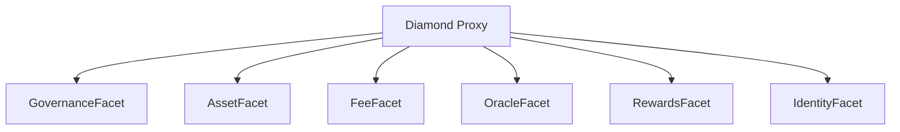

# Migrating D-Loop Protocol to a Diamond Pattern Architecture (EIP-2535)

---

## Overview

This document outlines a comprehensive approach for migrating the D-Loop Protocol’s modular smart contract system to a diamond pattern (EIP-2535) architecture. The diamond pattern enables highly modular, upgradeable, and gas-efficient smart contracts by splitting logic into "facets" and routing calls via a central "diamond" proxy.

**Scope:**
- This is a technical roadmap for post-Sepolia deployments and does not impact the current testnet implementation.

---

## 1. Why Consider the Diamond Pattern?

- **Upgradeability:** Upgrade or replace individual facets without redeploying the entire protocol.
- **Modularity:** Encapsulate features (governance, assets, oracles, fees, etc.) as separate facets.
- **Gas Efficiency:** Reduce contract size and deployment costs by splitting logic.
- **Composability:** Enable dynamic addition/removal of features.

---

## 2. Current Architecture Summary

- Contracts are organized by function (ProtocolDAO, AssetDAO, FeeProcessor, etc.), each as a separate deployable contract.
- Uses OpenZeppelin libraries for access control, security, and modularity.
- No proxy or diamond/facet logic is present.

---

## 3. Migration Steps

### Step 1: Identify Facet Boundaries

Map existing contracts/modules to logical facets:

| Existing Contract         | Proposed Facet Name         |
|--------------------------|-----------------------------|
| ProtocolDAO.sol          | GovernanceFacet             |
| AssetDAO.sol             | AssetFacet                  |
| FeeProcessor.sol         | FeeFacet                    |
| FeeCalculator.sol        | FeeCalculationFacet         |
| Treasury.sol             | TreasuryFacet               |
| DLoopToken.sol           | GovernanceTokenFacet        |
| DAIToken.sol             | AssetTokenFacet             |
| AINodeGovernance.sol     | NodeGovernanceFacet         |
| AINodeRegistry.sol       | NodeRegistryFacet           |
| GovernanceRewards.sol    | RewardsFacet                |
| ChainlinkPriceOracle.sol | OracleFacet                 |
| PriceOracleAdapter.sol   | OracleAdapterFacet          |
| SoulboundNFT.sol         | IdentityFacet               |
| TokenOptimizer.sol       | TokenOptimizerFacet         |
| TokenApprovalOptimizer.sol | ApprovalOptimizerFacet    |
| SimplifiedAdminControls.sol | AdminFacet               |

### Step 2: Refactor Contracts into Facets

- Remove inheritance from OpenZeppelin upgradeable patterns (if present).
- Flatten each contract into a single facet contract, removing constructor logic (use `init` functions instead).
- Move all state variables to a shared storage library (see EIP-2535 "diamond storage" pattern).
- Replace `msg.sender`-based access control with diamond-compatible role checks.

### Step 3: Implement Diamond Proxy

- Deploy a central Diamond contract that implements the EIP-2535 interface (`diamondCut`, `diamondLoupe`, etc.).
- Route all external calls through the diamond proxy to the appropriate facet via delegatecall.
- Store facet addresses and function selectors in the diamond’s storage.

### Step 4: Storage Management

- Use a single shared storage layout for all facets ("diamond storage").
- Refactor all state variable access to use the storage library pattern (e.g., `LibDLoopStorage`), ensuring no storage collisions.

#### Employing Diamond Storage

Diamond Storage is a Solidity pattern that enables all facets to safely share and access state variables without conflicts. This is achieved by defining a single storage struct in a dedicated library and accessing it via a fixed storage slot.

**Rationale:**
- Prevents storage slot collisions across facets.
- Centralizes all protocol state, making upgrades and facet additions safer.

**Pattern:**
- Define a storage struct in a library (e.g., `LibDLoopStorage`).
- Assign the struct to a unique storage slot using inline assembly.
- All facets read/write state via this library.

**Example:**

```solidity
// SPDX-License-Identifier: MIT
pragma solidity ^0.8.0;

library LibDLoopStorage {
    bytes32 constant STORAGE_POSITION = keccak256("dloop.diamond.storage");

    struct DLoopStorage {
        address protocolDao;
        address assetDao;
        mapping(address => uint256) balances;
        // ... add all protocol state here
    }

    function diamondStorage() internal pure returns (DLoopStorage storage ds) {
        bytes32 position = STORAGE_POSITION;
        assembly {
            ds.slot := position
        }
    }
}
```

**Usage in Facets:**

```solidity
import { LibDLoopStorage } from "../libraries/LibDLoopStorage.sol";

contract GovernanceFacet {
    function setProtocolDao(address dao) external {
        LibDLoopStorage.DLoopStorage storage ds = LibDLoopStorage.diamondStorage();
        ds.protocolDao = dao;
    }
    // ...
}

### Testnet Preparation

1. **Sepolia Deployment**
   - Deploy Diamond with mock facets
   - Simplified access control (single admin)
   - Enhanced event logging for debugging

2. **Pre-Migration Checks**
   - [ ] Storage layout verification
   - [ ] Malicious calldata testing
   - [ ] Emergency rollback mechanism

### Step 5: Initialization and Upgrades

- Implement `initialize` functions in each facet for one-time setup.
- Use `diamondCut` to add, replace, or remove facets as needed.
- Plan for upgrade procedures: write scripts for safe facet upgrades and access control changes.

### Step 6: Testing and Migration

- Write comprehensive tests for each facet and for diamond routing.
- Migrate existing test suite to interact with the diamond proxy.
- Test upgrades and facet swaps in a testnet environment before mainnet deployment.

---

## 4. Example Diamond Pattern Structure



---

## 5. Testing Strategy

### Diamond-Specific Tests
```
/test/diamond/
├── facetCut.test.js
├── loupe.test.js
└── upgrade.test.js
```

### Key Refactoring Requirements

- **State Management:** Move all state to diamond storage libraries.
- **Access Control:** Refactor to use diamond-compatible role checks.
- **Initialization:** Replace constructors with `init` functions.
- **Function Selectors:** Ensure unique selectors for all facet functions.
- **Testing:** Update all tests to interact with the diamond proxy.
- **Upgrade Scripts:** Write scripts for safe facet management (add/replace/remove).

---

## 6. References & Tooling
- [EIP-2535: Diamond Standard](https://eips.ethereum.org/EIPS/eip-2535)
- [Nick Mudge’s Diamond Implementation](https://github.com/mudgen/diamond-1)
- [OpenZeppelin Diamond Utilities](https://github.com/OpenZeppelin/diamond)
- [Solidity Storage Patterns](https://docs.soliditylang.org/en/latest/internals/layout_in_storage.html)

---

## 7. Recommendations

### Phase 1: Sepolia POC
- Start with FeeFacet
- 100% test coverage
- Gas profiling

### Phase 2: Mainnet Prep
- MythX analysis
- Time-locked upgrades
- Multi-sig diamondCut

---

## 8. Out of Scope
- This migration is not required for Sepolia testnet deployment and should be considered for post-testnet/mainnet planning.
