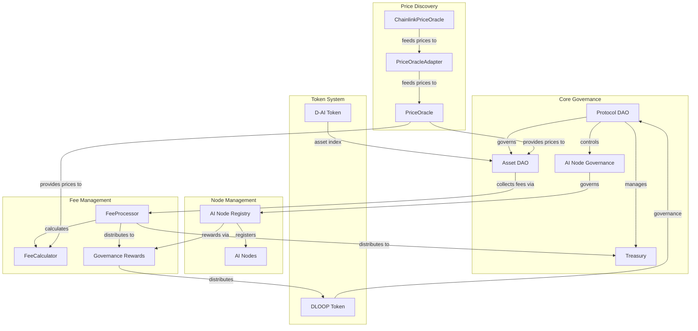

# D-Loop Sepolia Testnet Gap Analysis

---

## Overview
This document provides a detailed gap analysis between the D-Loop protocol's Sepolia testnet implementation and the architecture, features, and roadmap described in the whitepaper and supplementary documentation. It highlights what is delivered, what is simplified or deferred, and what remains to be addressed for mainnet readiness.

---

## 1. System Architecture Comparison

---

## 2. Gap Analysis Table

| Area                | Whitepaper/Supplementary | Sepolia Implementation        | Gaps/Deferred |
|---------------------|-------------------------|-------------------------------|---------------|
| ProtocolDAO         | Specified               | Implemented                   | Advanced voting, AI delegation |
| AssetDAO            | Specified               | Implemented                   | None (testnet) |
| Tokenomics          | Specified               | Implemented                   | Cross-chain, advanced modeling |
| Oracles             | Modular, Chainlink+     | Chainlink+fallback, adapter   | Multi-oracle, full aggregation |
| Fee/Treasury        | Flexible, proposal-based| Implemented, testnet mocks    | Dynamic routing, mainnet security |
| AI Node Management  | SoulboundNFT, registry  | Implemented                   | Reputation, cross-chain |
| Security            | RBAC, reentrancy, timelock | RBAC, reentrancy         | Timelock, upgradability |
| Testnet Adaptations | Documented              | Fully applied                 | More doc clarity |
| Testing             | Comprehensive           | Strong, ABI/fixtures/coverage | Mainnet audit, cross-chain |
| Future Extensions   | Cross-chain, AI, etc.   | Not expected/testnet          | N/A           |

---

## 3. Detailed Gap Commentary

### Governance & DAO
- **Delivered:** ProtocolDAO, AssetDAO, AINodeGovernance, GovernanceRewards.
- **Gaps:** AI agent delegation, quadratic/conviction voting, governance mining, cross-chain governance are not yet implemented.

### Tokenomics
- **Delivered:** DLOOP and D-AI tokens, mint/burn, delegation, reward flows.
- **Gaps:** Mainnet-grade 1:1 D-AI asset backing, cross-chain supply sync, portfolio rebalancing are deferred.

### Oracles & Price Discovery
- **Delivered:** ChainlinkPriceOracle (with fallback), PriceOracle, PriceOracleAdapter.
- **Gaps:** Multi-oracle aggregation, median selection, adapters for API3/UMA/LayerZero, advanced reliability logic.

### Fee & Treasury Management
- **Delivered:** FeeCalculator, FeeProcessor, Treasury (with mocks for testnet).
- **Gaps:** Dynamic fee routing, advanced splits (burns, voter incentives), mainnet security reviews.

### AI Node Management & Identity
- **Delivered:** AINodeRegistry, SoulboundNFT, SoulboundNFTAdapter.
- **Gaps:** Reputation scoring, advanced metadata, cross-chain verification.

### Security & Access Control
- **Delivered:** OpenZeppelin AccessControl, ReentrancyGuard, custom Errors.
- **Gaps:** Timelocks, multisig, upgradability patterns (UUPS/proxy), advanced permissioning.

### Testnet (Sepolia) Adaptations
- **Delivered:** Single deployer admin, mocks for oracles/treasury/fee distributor, reduced quorum, simplified flows.
- **Gaps:** Recommend more explicit documentation of all deviations in TESTNET_README.md.

### Testing & Validation
- **Delivered:** Extensive unit, integration, security, performance, ABI compatibility, and fixture-based tests.
- **Gaps:** Full economic simulation, cross-chain, and mainnet-level audits are pending.

### Future Extensions
- **Planned:** Cross-chain operations, advanced AI agent deployment, additional oracle integrations, portfolio rebalancing.
- **Gaps:** Not expected for testnet, but should be tracked for mainnet planning.

---

## 4. Recommendations
- Document all testnet simplifications and deviations in TESTNET_README.md.
- Prioritize mainnet upgrades: multisig, timelocks, upgradability, cross-chain, advanced governance.
- Extend oracle adapters for additional providers and aggregation logic.
- Develop advanced governance and AI delegation features as outlined in the whitepaper.
- Prepare for security audits and formal verification before mainnet launch.

---

## 5. References
- [D-Loop Whitepaper](d-loop-whitepaper.md)
- [Supplementary Features](d-loop-supplementary-features.md)
- [Sepolia Requirements](SEPOLIA_REQUIREMENTS.md)
- [Technical Architecture](docs/technical-docs/ARCHITECTURE.md)
- [Contract Documentation](docs/technical-docs/CONTRACTS.md)
