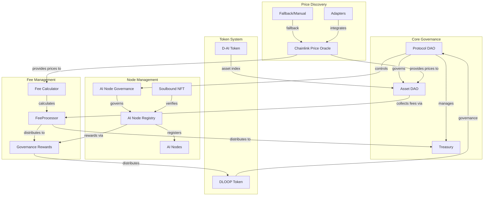

# D-Loop Protocol System Architecture

## Protocol Overview

The D-Loop Protocol is a decentralized platform that enables AI node governance, asset management, and reward distribution within a comprehensive ecosystem. The protocol leverages blockchain technology to create a trustless environment for AI node operators, investors, and users.

### Core Components



## Technical Stack

### Smart Contract Architecture

The D-Loop Protocol is built on Ethereum and Sepolia Testnet using Solidity 0.8.24. The contract architecture follows a modular design pattern with clear separation of concerns:

1. **Core Contracts**: Central governance and asset management
   - `ProtocolDAO.sol`: Protocol-level governance and decision-making
   - `AssetDAO.sol`: Asset creation, investment, and management

2. **Token Contracts**: Protocol tokens and utilities
   - `DLoopToken.sol`: Governance token with delegation capabilities
   - `DAIToken.sol`: D-Loop Asset Index Token (D-AI) representing the asset index
   - `TokenOptimizer.sol`: Gas optimization for token operations

3. **Fee Management**:
   - `FeeProcessor.sol`: Processes and distributes fees
   - `FeeCalculator.sol`: Calculates fees based on protocol parameters
   - `Treasury.sol`: Manages protocol treasury funds

4. **Governance**:
   - `AINodeGovernance.sol`: Governance for AI nodes
   - `AINodeRegistry.sol`: Registry for AI node operators
   - `GovernanceRewards.sol`: Distributes rewards to governance participants
   - `SimplifiedAdminControls.sol`: Testnet-specific simplified admin controls

5. **Oracles**:
   - `ChainlinkPriceOracle.sol`: Provides price data for assets
   - `FallbackManual.sol`: Fallback/manual price oracle
   - `Adapters.sol`: Adapters for integrating with other oracle sources

6. **Identity Verification**:
   - `SoulboundNFT.sol`: Non-transferable NFT for node identity

### Security Model

The D-Loop Protocol implements a comprehensive security model:

1. **Access Control**: Role-based access control using OpenZeppelin's AccessControl
2. **Reentrancy Protection**: Nonreentrant modifiers on critical functions
3. **Input Validation**: Extensive validation of inputs to prevent attacks
4. **Custom Error Handling**: Gas-efficient custom errors for better debugging
5. **Pause Mechanism**: Emergency pause functionality for critical contracts

## Sepolia Testnet Adaptations

For the Sepolia testnet deployment, several adaptations have been made to simplify the protocol while maintaining core functionality:

1. **Simplified Admin Controls**: Single deployer address instead of multisig
2. **Mock Components**: Mock implementations for oracles, treasury, and fee distributor
3. **Simplified Quorum**: Reduced quorum requirements for governance (10% vs. mainnet's higher threshold)
4. **Gas Optimizations**: Focus on optimizing token operations for testnet conditions

## Protocol Flows

### Asset Creation and Investment Flow

1. User creates an asset through AssetDAO
2. Asset becomes available for investment
3. Users invest in the asset using D-AI tokens
4. Fees are collected and distributed via FeeProcessor
5. Asset creator and investors receive rewards based on performance

### Governance Flow

1. User creates a proposal in ProtocolDAO
2. DLOOP token holders vote on the proposal
3. If quorum is reached and proposal passes, it can be executed after delay
4. Changes are implemented at the protocol level

### AI Node Registration Flow

1. Node operator registers in AINodeRegistry
2. Node identity is verified through SoulboundNFT
3. Node becomes eligible for governance participation
4. Node receives rewards through GovernanceRewards based on contribution

## Integration Points

The D-Loop Protocol integrates with several external systems:

1. **Price Oracles**:
   - **Primary Implementation**: `ChainlinkPriceOracle.sol` (integrates Chainlink feeds with staleness checks, fallback prices, and role-based management)
   - **Secondary/Legacy Implementation**: `FallbackManual.sol` (supports direct/manual price setting, used for testnet and as a backup)
   - **Adapters**: `Adapters.sol` for integration with other oracle sources or future expansion
   - **Data Flow**: Chainlink/External Oracle → ChainlinkPriceOracle/Adapters → AssetDAO/FeeCalculator
   - **Update Mechanism**: Supports both push (oracle updates) and pull (protocol queries), with fallback to manual/admin price if Chainlink is stale
   - **Fallback System**: Custom fallback logic and staleness protection, with events for stale/fallback usage
   - **Role Management**: Uses AccessControl for admin and feed manager roles
   - **Testnet (Sepolia) Integration**: Allows mock/manual price updates and fallback for rapid testing
   - **Future Extensions**: Designed to support additional oracle providers (API3, UMA, LayerZero, etc.)

2. **Token Standards**:
   - **ERC20**: Core implementation for D-AI and DLOOP tokens
   - **Extensions**: ERC20Burnable, ERC20Pausable for security controls
   - **Custom Extensions**: Delegation system for DLOOP governance
   - **Gas Optimizations**: TokenOptimizer for batch operations

3. **Identity Verification**:
   - **SoulboundNFT**: Non-transferable NFT for node identity
   - **Verification Flow**: External verification → SoulboundNFT mint → AINodeRegistry validation
   - **Metadata Storage**: IPFS for extended node metadata
   - **Revocation Mechanism**: Admin-controlled with governance oversight

## Technical Specifications

### Contract Interactions

#### Asset Management Flow
```
User → AssetDAO.createAsset() → Asset Created
User → AssetDAO.investInAsset() → FeeProcessor.collectInvestmentFee() → Treasury/GovernanceRewards
Asset Performance → ChainlinkPriceOracle → AssetDAO → Rewards Distribution
User → AssetDAO.divestFromAsset() → FeeProcessor.collectDivestmentFee() → Treasury/GovernanceRewards
```

#### Governance Flow
```
User → ProtocolDAO.createProposal() → Proposal Created
DLOOP Holders → ProtocolDAO.castVote() → Voting Period
After Quorum & Delay → ProtocolDAO.executeProposal() → Protocol Changes
```

#### Node Registration Flow
```
Operator → External Verification → SoulboundNFT
Operator → AINodeRegistry.registerNode() → Node Registered
AINodeGovernance → Periodic Validation → Rewards Eligibility
GovernanceRewards → Reward Distribution → Operator
```

### Data Structures

#### Asset Structure
```solidity
struct Asset {
    address creator;           // Asset creator address
    string name;               // Asset name
    string description;        // Asset description
    uint256 totalShares;       // Total shares issued
    uint256 totalInvestment;   // Total investment amount
    mapping(address => uint256) shares; // Investor shares
    bool active;               // Asset active status
    uint256 creationTime;      // Asset creation timestamp
}
```

#### Proposal Structure
```solidity
struct Proposal {
    address proposer;          // Proposal creator
    string description;        // Proposal description
    bytes data;                // Execution data
    address target;            // Target contract for execution
    uint256 votingStarts;      // Voting start timestamp
    uint256 votingEnds;        // Voting end timestamp
    uint256 yesVotes;          // Yes vote count
    uint256 noVotes;           // No vote count
    bool executed;             // Execution status
    mapping(address => bool) hasVoted; // Voter tracking
}
```

#### Node Structure
```solidity
struct AINode {
    address operator;          // Node operator address
    string metadata;           // Node metadata (IPFS hash)
    bool active;               // Node active status
    uint256 registrationTime;  // Registration timestamp
    uint256 lastUpdateTime;    // Last update timestamp
    uint256 reputationScore;   // Reputation score
}
| D-AI Decimals | 18 | Token precision |

## Future Extensions

As outlined in the supplementary features document, the protocol is designed to support:

1. **Cross-chain Operations** (deferred for mainnet)
   - Layer 2 integration for scalability (Optimism, Arbitrum)
   - Cross-chain messaging via LayerZero or Chainlink CCIP
   - Asset mirroring across multiple chains
   - Unified governance across chain deployments

2. **Advanced Access Control Mechanisms**
   - Time-locked admin actions with cancellation options
   - Multi-signature requirements (2-of-3, 3-of-5 configurations)
   - Role-based permission hierarchies with delegation
   - Graduated access based on reputation scores

3. **Enhanced Oracle Integrations**
   - Chainlink Data Feeds for primary price discovery
   - API3 integration for secondary data sources
   - UMA optimistic oracle for dispute resolution
   - Custom aggregation logic for price reliability

4. **Governance Enhancements**
   - ProtocolDAO Quadratic voting implementation
   - Conviction voting for continuous preference expression
   - Governance action templates with parameter constraints
   - Governance mining incentives for participation
