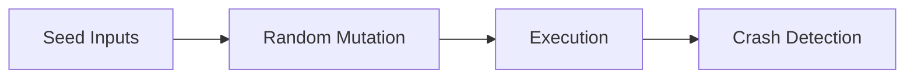
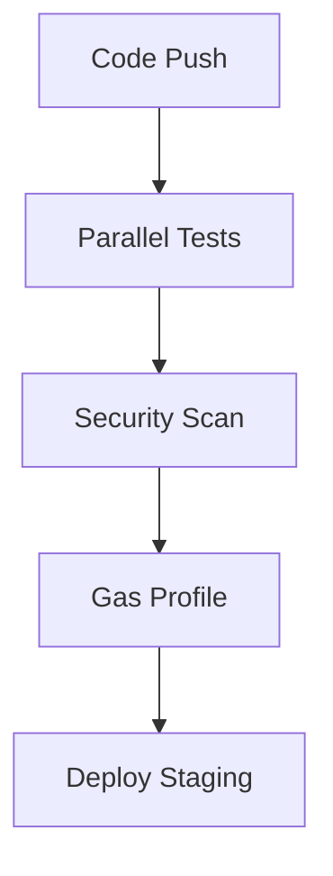

# D-Loop Protocol Testing Guide

This guide provides comprehensive instructions for running tests, analyzing results, and maintaining the testing pipeline for the D-Loop Protocol.

## Table of Contents

1. [Testing Overview](#testing-overview)
2. [Test Structure](#test-structure)
3. [Running Tests](#running-tests)
4. [Gas Profiling](#gas-profiling)
5. [Coverage Analysis](#coverage-analysis)
6. [Fuzz Testing](#fuzz-testing)
7. [CI/CD Integration](#cicd-integration)
8. [Troubleshooting](#troubleshooting)
9. [Contributing New Tests](#contributing-new-tests)

## Testing Overview

The D-Loop Protocol testing suite is designed to ensure:

- **Functional Correctness**: All contracts behave as expected under normal conditions
- **Cross-Contract Integration**: Contracts interact correctly with each other
- **Security**: No vulnerabilities exist in the protocol
- **Gas Efficiency**: Operations remain within acceptable gas limits
- **Edge Case Handling**: Protocol handles unexpected inputs gracefully

Our testing approach combines:

- **Unit Tests**: Testing individual contract functions in isolation
- **Integration Tests**: Testing interactions between multiple contracts
- **Gas Profiling**: Measuring gas usage for critical functions
- **Fuzz Testing**: Property-based testing with randomized inputs
- **Coverage Analysis**: Ensuring comprehensive test coverage

## Test Structure

```
test/
├── unit/                   # Unit tests for individual contracts
├── integration/            # Integration tests for contract interactions
│   ├── flows/              # End-to-end workflow tests
│   ├── interfaces/         # Cross-contract interface tests
│   ├── token-flows/        # Token-specific flow tests
│   └── security/           # Security-focused tests
├── performance/            # Performance and gas usage tests
│   └── gas-profiles/       # Gas profiling for critical functions
├── foundry/                # Foundry-based fuzz tests
│   └── token/              # Token-specific fuzz tests
├── validation/             # Validation tests for contract interfaces and mocks
│   └── *.ABI.compatibility.test.js  # ABI compatibility tests
├── fixtures/               # Reusable test fixtures
└── utils/                  # Testing utilities and helpers
```

## Running Tests

### Prerequisites

- Node.js v16 or higher
- Hardhat
- Foundry (for fuzz testing)

### Installing Dependencies

```bash
npm install
```

### Running All Tests

```bash
npm test
```

### Running Specific Test Categories

```bash
# Run unit tests only
npx hardhat test test/unit/**/*.test.js

# Run integration tests only
npx hardhat test test/integration/**/*.test.js

# Run gas profiling tests
npx hardhat test test/performance/gas-profiles/*.test.js

# Run a specific test file
npx hardhat test test/integration/token-flows/DAIToken.flow.test.js
```

### Running Fuzz Tests with Foundry

```bash
# Install Foundry if not already installed
curl -L https://foundry.paradigm.xyz | bash
foundryup

# Run all fuzz tests
forge test

# Run a specific fuzz test
forge test --match-contract DAITokenFuzzTest
```

## Gas Profiling

Gas profiling helps ensure that contract operations remain efficient and cost-effective.

### Running Gas Profiling

```bash
# Run gas profiling tests
npx hardhat test test/performance/gas-profiles/critical-functions.gas.test.js

# Generate gas report
node scripts/check-gas-limits.js
```

### Interpreting Gas Reports

The gas report compares current gas usage against:

1. **Hard Limits**: Maximum acceptable gas usage for each function
2. **Baseline**: Previous gas measurements to detect regressions

Example report:

```
=== Gas Usage Analysis ===
Function                 | Current | Baseline | % Change | Hard Limit | Status
----------------------------------------------------------------------------------
daiTransfer              |   51234 |    50982 |    +0.49% |     55000 | OK
daiApprove               |   46123 |    46123 |    +0.00% |     48000 | OK
assetCreation            |  235678 |   230123 |    +2.41% |    250000 | OK
assetInvestment          |  175432 |   168975 |    +3.82% |    180000 | EXCEEDS BASELINE (+3.82%)
treasuryWithdrawal       |   88765 |    87654 |    +1.27% |     90000 | OK
```

**Status Indicators**:
- **OK**: Function is within both hard limits and acceptable baseline increase
- **EXCEEDS BASELINE**: Function exceeds the baseline by more than the acceptable percentage (3.2%)
- **EXCEEDS LIMIT**: Function exceeds the hard gas limit

### Updating Baselines

After verifying that gas increases are acceptable:

```bash
# Update baseline with current measurements
node scripts/update-gas-baseline.js
```

## Coverage Analysis

Coverage analysis ensures that tests exercise all code paths in the contracts.

### Running Coverage Analysis

```bash
# Generate coverage report
npx hardhat coverage

# Open the HTML report
open coverage/index.html
```

### Interpreting Coverage Reports

The coverage report shows:

- **Statement Coverage**: Percentage of code statements executed
- **Branch Coverage**: Percentage of code branches (if/else) executed
- **Function Coverage**: Percentage of functions called
- **Line Coverage**: Percentage of code lines executed

**Minimum Coverage Thresholds**:
- Statements: 90%
- Branches: 85%
- Functions: 95%
- Lines: 90%

### Improving Coverage

If coverage is below thresholds:

1. Identify uncovered code in the HTML report (highlighted in red)
2. Add tests specifically targeting those areas
3. Focus on critical functions and security-sensitive code paths

## AssetDAO Governance Rewards Testing

The D-Loop Protocol implements a unique governance rewards system where participants in AssetDAO governance are rewarded based on the outcomes of their investment and divestment decisions. This section provides a comprehensive guide to testing the AssetDAO governance rewards mechanism.

### Key Concepts

1. **AssetDAO vs. ProtocolDAO**: Governance rewards are issued for AssetDAO proposals, not for ProtocolDAO governance. This is a critical distinction in the D-Loop architecture. AssetDAO governs the investment and divestment decisions for AI assets, while ProtocolDAO governs the protocol parameters and upgrades.

2. **Merit-Based Rewards**: Rewards are distributed based on the quality and outcome of governance decisions:
   - Successful investment proposals (price increases after a "Yes" vote)
   - Avoiding bad investments (price decreases after a "No" vote)
   - Successful divestment proposals (price decreases after divestment)
   - Avoiding premature divestment (price increases after a "No" vote on divestment)

3. **Reward Distribution Mechanism**: The GovernanceRewards contract distributes DLOOP tokens to participants based on their contributions to correct governance decisions. The reward amount is calculated using the following factors:
   - Base reward amount (configurable)
   - Voting participation bonus (for high participation rates)
   - Proposal quality multiplier (for proposals with strong consensus)
   - AI node multiplier (for AI-assisted governance)

4. **Reward Parameters**: The reward distribution is controlled by configurable parameters:
   - Base reward: The standard reward amount for participation
   - Voting participation bonus: Bonus percentage for high voting turnout
   - Proposal quality multiplier: Multiplier for proposals with high yes/no ratio
   - AI node multiplier: Multiplier for AI node participation
   - Reward cap: Maximum reward per distribution

### Testing Approach

```bash
# Run basic AssetDAO governance rewards tests
npx hardhat test test/integration/flows/AssetDAO.governance.rewards.test.js

# Run enhanced governance rewards tests (edge cases, parameterization, gas profiling)
npx hardhat test test/integration/flows/AssetDAO.governance.enhanced.test.js
```

The AssetDAO governance rewards tests cover:

1. **Basic Reward Distribution**:
   - Creating investment proposals
   - Voting on proposals
   - Simulating price changes
   - Verifying reward distribution based on outcomes

2. **Edge Cases**:
   - Proposals with very low participation
   - Proposals with tied votes (50/50 split)
   - Multiple proposals from the same proposer within cooldown period
   - Extreme voting scenarios (100% yes, 100% no)

3. **Parameterization Testing**:
   - Testing how changes to reward parameters affect distribution outcomes
   - Verifying the impact of different base rewards
   - Testing participation bonus thresholds
   - Validating quality multiplier effects

4. **Gas Optimization**:
   - Profiling gas usage of the reward distribution process
   - Identifying optimization opportunities
   - Measuring the impact of parameter changes on gas usage

5. **Integration Testing**:
   - Full flow from AssetDAO proposal creation to reward distribution
   - Interaction between AssetDAO, GovernanceRewards, and token contracts
   - Validation of reward distribution timing and amounts

### Test Fixtures

The AssetDAO governance rewards tests use dedicated fixtures that set up:

- AssetDAO contract
- GovernanceRewards contract
- Mock price oracle for simulating price changes
- D-AI and DLOOP tokens for governance and rewards
- Mock assets for investment proposals

### Common Testing Patterns

1. **Proposal Lifecycle Testing**:
   ```javascript
   // Create proposal
   const tx = await assetDAO.connect(user).createProposal(
     proposalType, // 0 for Investment, 1 for Divestment
     assetAddress,
     amount,
     description
   );
   
   // Vote on proposal
   await assetDAO.connect(voter).vote(proposalId, support);
   
   // Execute proposal
   await assetDAO.connect(admin).executeProposal(proposalId);
   ```

2. **Price Simulation**:
   ```javascript
   // Simulate price change
   await priceOracle.setPrice(assetAddress, newPrice);
   ```

3. **Reward Distribution**:
   ```javascript
   // Distribute rewards
   await governanceRewards.connect(admin).distributeRewards(
     proposer.address,
     yesVotes,
     noVotes,
     totalSupply
   );
   
   // Verify rewards
   const rewardsEarned = await governanceRewards.totalRewardsEarned(proposer.address);
   expect(rewardsEarned).to.be.gt(0);
   ```

4. **Parameter Testing**:
   ```javascript
   // Update reward parameters
   await governanceRewards.connect(admin).updateRewardConfig(
     ethers.parseEther("200"),  // baseReward
     3000,                      // votingParticipationBonus (30%)
     20000,                     // proposalQualityMultiplier (2x)
     15000,                     // aiNodeMultiplier (1.5x)
     ethers.parseEther("1000")  // rewardCap
   );
   
   // Distribute rewards with new parameters
   await governanceRewards.connect(admin).distributeRewards(
     proposer.address, yesVotes, noVotes, totalSupply
   );
   ```

5. **Gas Profiling**:
   ```javascript
   // Measure gas usage
   const tx = await governanceRewards.connect(admin).distributeRewards(
     proposer.address, yesVotes, noVotes, totalSupply
   );
   
   const receipt = await tx.wait();
   const gasUsed = receipt.gasUsed;
   console.log(`Gas used: ${gasUsed.toString()}`);
   ```

### Testing Edge Cases

Testing edge cases is crucial for ensuring the robustness of the governance rewards system:

1. **Low Participation**:
   - Test proposals with participation below the bonus threshold
   - Verify that base rewards are distributed without participation bonus

2. **Tied Votes**:
   - Test proposals with equal yes and no votes
   - Verify that quality multiplier is not applied

3. **Cooldown Period**:
   - Test multiple reward distributions to the same proposer within the cooldown period
   - Verify that the system correctly enforces the cooldown

4. **Parameter Boundaries**:
   - Test reward distribution with minimum and maximum parameter values
   - Verify system behavior at parameter boundaries

### Reward Calculation Verification

To verify correct reward calculation, compare the actual rewards with expected values based on the formula:

```javascript
// Calculate expected reward
let expectedReward = baseReward;

// Apply participation bonus if applicable
if (participationRate > 2000) { // > 20%
  expectedReward += baseReward * participationBonus / 10000;
}

// Apply quality multiplier if applicable
if (yesVotes > noVotes && qualityRatio > 7500) { // > 75% yes
  expectedReward = expectedReward * qualityMultiplier / 10000;
}

// Apply reward cap
expectedReward = Math.min(expectedReward, rewardCap);

// Verify actual reward matches expected
expect(actualReward).to.equal(expectedReward);
```

## Fuzz Testing

Fuzz testing uses randomized inputs to discover edge cases and vulnerabilities.

### Fuzz Testing Standards



**Requirements**:
- Minimum 10,000 runs per fuzz test
- Edge cases must include:
  - Zero values
  - Maximum uint256
  - Invalid addresses

**Example**:
```javascript
describe('AssetDAO Fuzz', () => {
  it('should handle random transfers', async () => {
    // Fuzz logic
  })
})
```

### Running Fuzz Tests

```bash
# Run all fuzz tests
forge test

# Run with increased fuzz runs (more thorough)
forge test --fuzz-runs 5000
```

### Interpreting Fuzz Test Results

Fuzz tests verify properties that should hold true regardless of inputs:

- **Balance Consistency**: Transfers should correctly update balances
- **Total Supply Invariant**: Total supply should only change with mint/burn
- **Access Control**: Unauthorized users cannot perform restricted actions

Failed fuzz tests indicate potential vulnerabilities or edge cases.

## CI/CD Integration

### CI/CD Pipeline v2



**Key Changes**:
- Matrix testing (3x faster)
- Automated artifact retention
- Coverage enforcement (95%+)

**New Commands**:
```bash
# Run specific test suite
./scripts/test/run_full_test_suite.sh --unit AssetDAO

# Generate gas report
REPORT_GAS=true npm test
```

### Viewing CI Results

1. Go to the GitHub repository
2. Click on "Actions" tab
3. Select the latest workflow run
4. Review job results and artifacts

## Troubleshooting

### Common Issues

#### Tests Failing with "Transaction Reverted"

- Check that contract state is properly set up in test fixtures
- Verify that accounts have sufficient token balances
- Ensure proper role assignments for access control

#### Gas Profiling Failures

- If functions exceed gas limits, look for optimization opportunities
- Consider refactoring complex operations into multiple steps
- Review storage access patterns which can be gas-intensive

#### Coverage Analysis Issues

- If solidity-coverage crashes, try running with `--temp` flag
- Exclude complex libraries or non-essential files from coverage

## ABI Compatibility Tests

ABI compatibility tests ensure that contract interfaces remain consistent and match expected function and event signatures.

### Running ABI Compatibility Tests

```bash
# Run all ABI compatibility tests
npx hardhat test test/validation/*.ABI.compatibility.test.js

# Run specific ABI compatibility test
npx hardhat test test/validation/Governance.ABI.compatibility.test.js
```

### Creating ABI Compatibility Tests

To create a new ABI compatibility test:

1. Define expected function signatures in canonical format (e.g., `"function(type1,type2)"`).
2. Define expected event signatures in canonical format (e.g., `"Event(type1,type2)"`).
3. Use contract artifacts to verify that actual signatures match expected ones.

```javascript
const expectedFunctions = {
  ContractName: [
    "functionName(paramType1,paramType2)",
    // Additional functions...
  ]
};

const expectedEvents = {
  ContractName: [
    "EventName(paramType1,paramType2)",
    // Additional events...
  ]
};
```

## Test Fixtures

Test fixtures provide reusable setup code for deploying contracts and establishing test environments.

### Using Test Fixtures

```javascript
const { loadFixture } = require("@nomicfoundation/hardhat-network-helpers");
const { deployDLoopProtocolFixture } = require("../fixtures/protocol.fixture");

it("should test something", async function() {
  const { contract1, contract2 } = await loadFixture(deployDLoopProtocolFixture);
  // Test implementation
});
```

### Creating Test Fixtures

Create modular fixtures that deploy specific parts of the protocol:

```javascript
// In fixtures/protocol.fixture.js
async function deployDLoopProtocolFixture() {
  // Deploy contracts
  // Set up initial state
  return { /* deployed contracts */ };
}
```

## Contributing New Tests

When adding new features or fixing bugs, follow these guidelines:

1. **Add Unit Tests**: Test individual functions in isolation
2. **Add Integration Tests**: Test interactions with other contracts
3. **Add ABI Compatibility Tests**: Ensure interfaces remain consistent
4. **Update Test Fixtures**: Maintain reusable setup code
5. **Update Gas Baselines**: Run gas profiling and update baselines
6. **Verify Coverage**: Ensure new code is covered by tests

### Test Template

```javascript
const { expect } = require("chai");
const { ethers } = require("hardhat");
const { loadFixture } = require("@nomicfoundation/hardhat-network-helpers");

describe("Contract Feature", function () {
  // Test fixture to set up contract state
  async function deployFixture() {
    // Setup code...
    return { /* contracts and variables */ };
  }

  it("Should perform expected behavior", async function () {
    const { contract } = await loadFixture(deployFixture);
    
    // Arrange - set up test conditions
    
    // Act - perform the action being tested
    
    // Assert - verify the results
    expect(/* actual result */).to.equal(/* expected result */);
  });
});
```

## Conclusion

Following this testing guide will help maintain the security, functionality, and efficiency of the D-Loop Protocol. Regular testing is essential to ensure the protocol remains robust as it evolves.

For questions or suggestions about the testing process, please contact the D-Loop Protocol development team.
